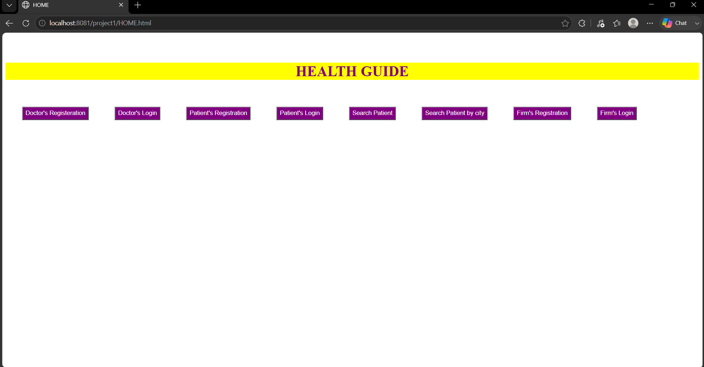
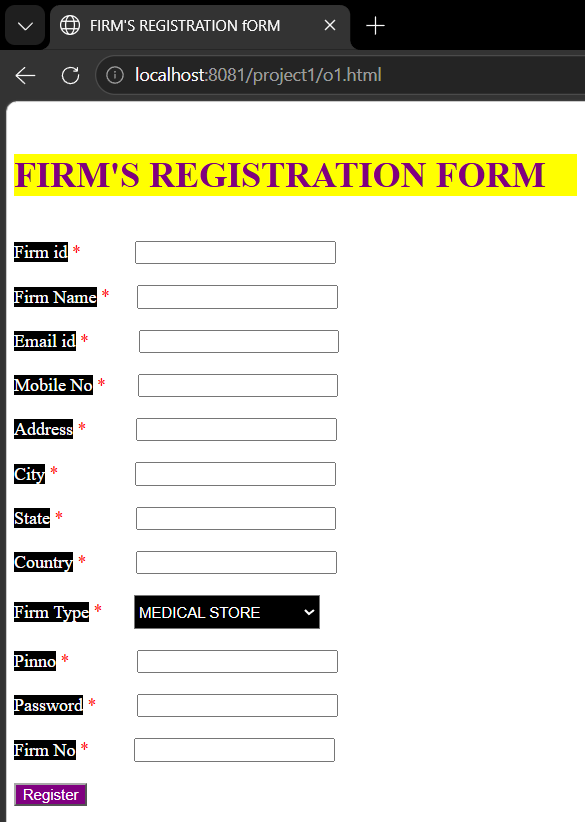
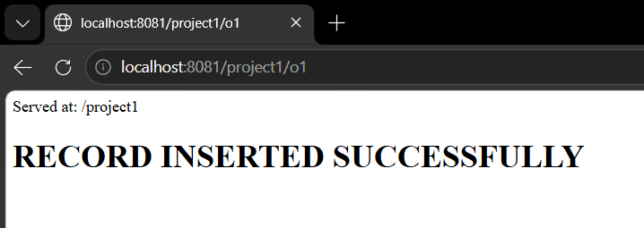
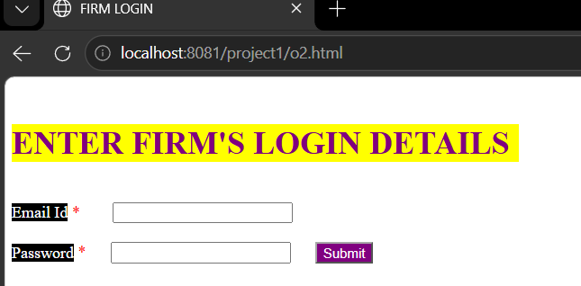
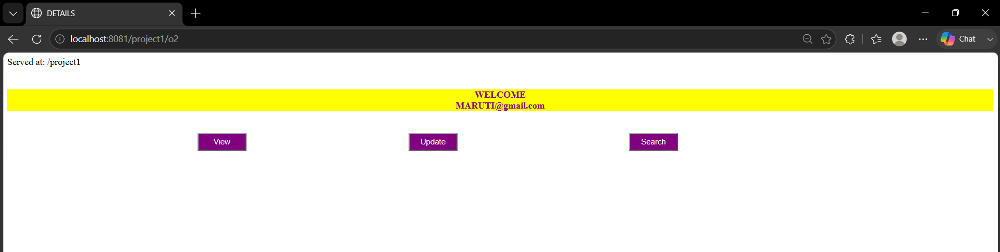

# 🏥 Health Guide – JDBC Web Application

## 🖥️ Application Screenshots

### 🏠 Home & Firm Module
- Home Page



- Firm Registration



- Firm Record Inserted Successfully



- Firm Login



- Firm Welcome Page



- Firm View Patient's Details


- Firm Update Patient's Details


- Firm Delete Patient's Details


### 👨‍⚕️ Doctor Module
- Doctor Login
- Doctor Registration
- Doctor Registration Success
- Doctor Prescription
- Update Doctor
- View Doctor Details

### 🧑‍🤝‍🧑 Patient Module
- Patient Login
- Patient Registration
- Patient Registration Success
- Search Patient
- Update Patient
- View Patient Details

### 💊 Prescription Module
- Enter Prescription
- Search Prescription
- Update Prescription
- Close Prescription

## 📌 Project Overview

**Health Guide** is a Java-based web application developed using **JDBC, Servlets, JSP/HTML, and MySQL**.
The system simulates a **basic healthcare management platform** where:

* **Firms (Other Users)** can register, log in, and manage their details
* **Doctors** can register, update, and view prescriptions
* **Patients** can view prescriptions and personal details
* **Prescriptions** can be created, searched, and closed

The project demonstrates **end-to-end database connectivity using JDBC** along with **CRUD operations** and **session management** in a web environment.

---

## 🎯 Objectives

* To understand **Java JDBC connectivity** with MySQL
* To implement **real-world CRUD operations** in a healthcare scenario
* To practice **Servlet-based web development**
* To learn **session handling, validation, and SQL debugging**
* To build a **mini full-stack Java project** suitable for academic submission

---

## ⚙️ Technologies Used

### 💻 Backend

* Java (Servlets, JDBC)
* Apache Tomcat 10

### 🗄️ Database

* MySQL
* SQL (DDL, DML, Constraints)

### 🌐 Frontend

* HTML
* Basic CSS styling
* Form-based navigation

### 🛠 Tools

* Eclipse IDE
* MySQL Command Line / Workbench
* Git & GitHub

---

## 🗃️ Database Modules

### 1. **Other Users (Firms)**

Stores firm registration and login data:

* id, firmname, email, mobileno
* address, city, state, country
* firmtype, pinno, password, firmno

### 2. **Doctors**

Stores doctor professional information:

* doctorid, doctorname, degree, specialization
* experience, contact details, working hospital
* authentication credentials

### 3. **Patients**

Stores patient personal and medical info:

* patientid, patientname, age, bloodgroup
* contact and address details

### 4. **Prescriptions**

Handles medical prescriptions:

* prescriptionid, patientid, disease name
* medicines, dosage, date
* supports **open and closed prescriptions**

---

## 🔐 Core Functionalities

### 👤 Authentication

* Separate login for **firms, doctors, and patients**
* Session-based navigation after login

### 📝 CRUD Operations

* Register / View / Update / Delete records
* Add and search prescriptions
* Close prescriptions (move to closed table)

### 🔎 Search Features

* Search prescriptions by:

  * **Prescription ID**
  * **Date**
  * **Patient**

### 📦 Session Management

* Stores logged-in user data across pages
* Maintains workflow between servlets

---

## 🧠 Key Concepts Demonstrated

* JDBC **Connection → PreparedStatement → ResultSet** flow
* **Parameterized queries** to prevent SQL injection
* **Auto-increment primary keys & foreign keys**
* **Servlet request handling (GET/POST)**
* **Tomcat deployment & server configuration**

---

## ⚠️ Challenges Faced During Development

### 1. Database Column Mismatch

Errors like:

* `Column 'emailid' not found`
* `Column 'id' not found`
* `Column 'firmname' not found`

**Cause:**
Java column names ≠ MySQL column names.

**Resolution:**

* Standardized column naming
* Used `ALTER TABLE` to rename fields
* Ensured Java & SQL schema consistency

---

### 2. Incorrect INSERT Order

Error:

```
Incorrect integer value: 'Viral Fever' for column 'patientid'
```

**Cause:**
Wrong parameter order in `PreparedStatement`.

**Resolution:**

* Skipped auto-increment column
* Matched SQL column order with Java setters

---

### 3. Tomcat Server Issues

Problems:

* Missing **Servers** configuration
* **Port 8080 already in use**

**Resolution:**

* Recreated Tomcat server in Eclipse
* Killed background process or changed port

---

### 4. Deprecated MySQL Driver

Warning:

```
com.mysql.jdbc.Driver is deprecated
```

**Fix:**
Used:

```
com.mysql.cj.jdbc.Driver
```

---

### 5. Session Handling Errors

* Null session attributes
* Incorrect data flow between servlets

**Fix:**

* Proper `HttpSession` usage
* Controlled navigation between modules

---

## 📈 Learning Outcomes

Through this project, I gained:

* Strong understanding of **JDBC integration**
* Hands-on experience with **Servlet-based web apps**
* Real debugging skills for **SQL & server errors**
* Knowledge of **database normalization & schema design**
* Confidence in building **end-to-end Java web projects**

---

## 🚀 Future Improvements

* Add **JSP/Servlet MVC architecture**
* Implement **password hashing (BCrypt)**
* Improve **UI with Bootstrap**
* Add **REST API & Spring Boot migration**
* Deploy on **cloud hosting**

---

## 👨‍💻 Author

**Ayush Chopra**


---

⭐ *This project is created for academic learning and demonstrates practical JDBC-based healthcare management functionality.*
